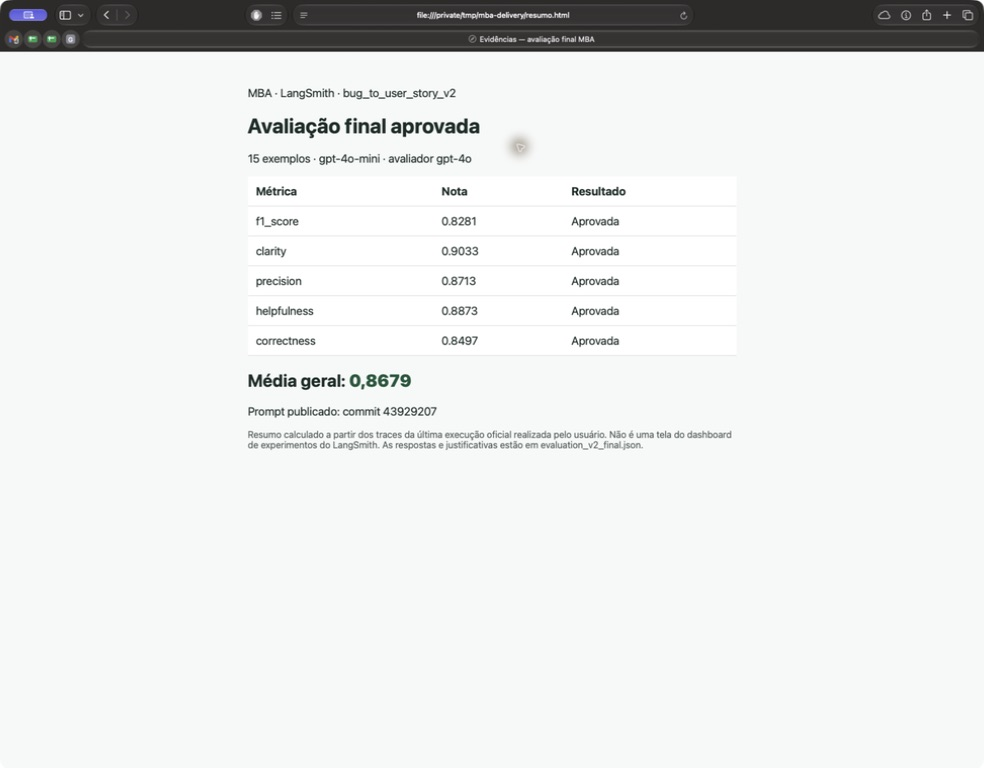
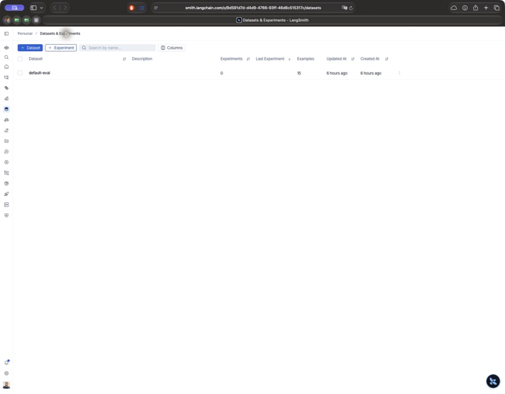
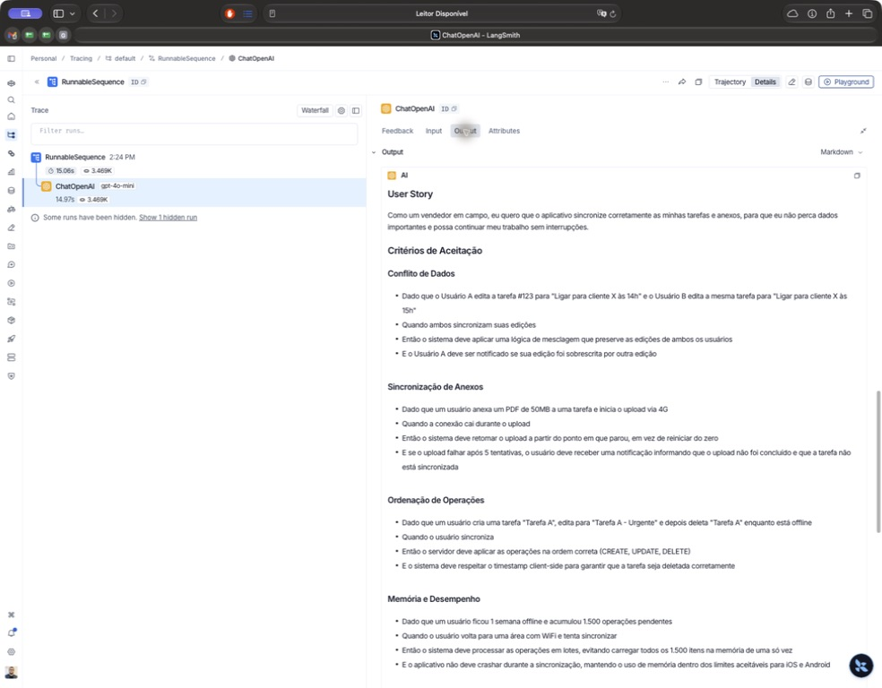
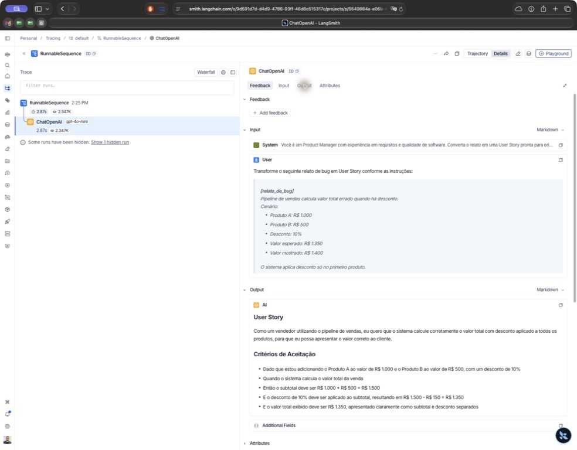
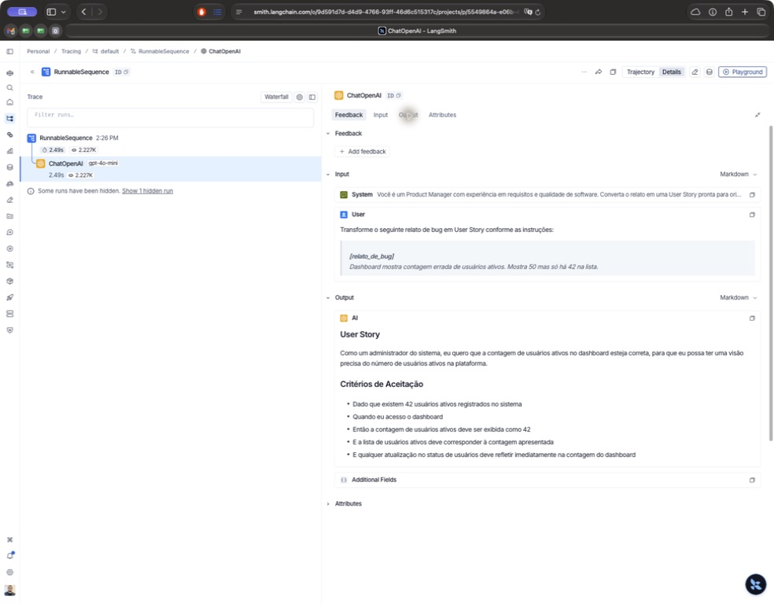

# Entrega — otimização de prompts com LangSmith

**Resultado final: aprovado.** Duas execuções oficiais consecutivas do prompt v2 publicado no commit `43929207` atingiram todas as cinco médias ≥ 0,80. A última execução teve média **0,8679** em 15 exemplos.

| Métrica | Última execução |
|---|---:|
| helpfulness | 0.8873 |
| correctness | 0.8497 |
| f1_score | 0.8281 |
| clarity | 0.9033 |
| precision | 0.8713 |

## Como executar

Use Python 3.9+ e um ambiente virtual. Instale as dependências e configure o `.env` a partir de `.env.example`, com suas próprias credenciais. Nunca versionar o `.env`.

```bash
python3 -m venv venv
venv/bin/pip install -r requirements.txt
cp .env.example .env
# Edite .env antes de continuar.
venv/bin/python src/pull_prompts.py
venv/bin/python -m pytest tests/test_prompts.py -v
venv/bin/python src/push_prompts.py
env -u OPENAI_API_KEY venv/bin/python src/evaluate.py
```

O comando de push publica o prompt como público no username configurado. O pull obtém a v1; o push publica a v2 local; a avaliação usa a v2 do Hub. As chamadas de geração e julgamento utilizam a API do provedor configurado.

## Evidências da entrega

- [Prompt público no LangSmith](https://smith.langchain.com/hub/teste-renato/bug_to_user_story_v2).
- [Última avaliação completa](evaluation_v2_final.json): respostas, notas exatas, justificativas e links dos 15 traces, recuperados sem repetir chamadas aos modelos.
- [Primeira aprovação oficial](evaluation_v2_iteration_03.json) e [rodada diagnóstica anterior](evaluation_v2_iteration_02.json).
- [Dataset no LangSmith](https://smith.langchain.com/o/9d591d7d-d4d9-4766-93ff-46d6c515317c/datasets/7254a96b-bb94-4260-943f-20bd50c628c2). O acesso ao workspace e aos traces exige autenticação; as capturas abaixo ficam disponíveis no repositório.



O resumo acima foi preparado a partir das notas dos traces, não capturado de um dashboard de experimentos. O avaliador fornecido calcula as médias no terminal e registra chamadas via tracing; ele não cria um experimento nem associa essas notas como feedback de runs. Os arquivos protegidos foram preservados.



### Três exemplos de tracing

[Trace do caso 1](https://smith.langchain.com/o/9d591d7d-d4d9-4766-93ff-46d6c515317c/projects/p/5549864a-e06b-44a9-9f24-c69f6d8d21ef/r/4c2f0e98-1527-440c-b810-51a565a74345?poll=true)



[Trace do caso 7](https://smith.langchain.com/o/9d591d7d-d4d9-4766-93ff-46d6c515317c/projects/p/5549864a-e06b-44a9-9f24-c69f6d8d21ef/r/924df358-a6d7-40c8-9c06-9f9524f9aa92?poll=true)



[Trace do caso 12](https://smith.langchain.com/o/9d591d7d-d4d9-4766-93ff-46d6c515317c/projects/p/5549864a-e06b-44a9-9f24-c69f6d8d21ef/r/5152c1d5-9b3e-4863-9209-77db5bf1cc60?poll=true)



## Comparação entre versões e limites

| Aspecto | v1 | v2 final |
|---|---|---|
| Persona | Assistente genérico | Product Manager |
| Exemplos | Sem few-shot | Três exemplos autorais |
| Entrada | Relato repetido em system/human | Relato somente em human |
| Critérios | Instruções vagas | Critérios verificáveis e revisão de cobertura |
| Métricas | Não avaliada nesta entrega | Cinco médias ≥ 0,80 |

Não há medição de baseline v1 nesta entrega; as tabelas históricas abaixo comparam revisões da v2. Não foram inventadas notas para a v1. A avaliação é feita por LLM e varia entre execuções; aprovação das médias não implica aprovação de cada caso individual. Os 10 testes estruturais passaram. `utils.py`, `evaluate.py`, `metrics.py` e os datasets não foram alterados.

---

## Enunciado e histórico do desenvolvimento

# Pull, Otimização e Avaliação de Prompts com LangChain e LangSmith

## Objetivo

Você deve entregar um software capaz de:

- Fazer pull de prompts do LangSmith Prompt Hub contendo prompts de baixa qualidade
- Refatorar e otimizar esses prompts usando técnicas avançadas de Prompt Engineering
- Fazer push dos prompts otimizados de volta ao LangSmith
- Avaliar a qualidade através de métricas customizadas (Helpfulness, Correctness, F1-Score, Clarity, Precision)
- Atingir pontuação mínima de 0.8 (80%) em todas as métricas de avaliação

## Exemplo no CLI

Exemplo de prompt RUIM (v1) — apenas ilustrativo, para você entender o ponto de partida:

```
==================================================
Prompt: {seu_username}/bug_to_user_story_v1
==================================================

Métricas Derivadas:
  - Helpfulness: 0.45 ✗
  - Correctness: 0.52 ✗

Métricas Base:
  - F1-Score: 0.48 ✗
  - Clarity: 0.50 ✗
  - Precision: 0.46 ✗

❌ STATUS: REPROVADO
⚠️  Métricas abaixo de 0.8: helpfulness, correctness, f1_score, clarity, precision
```

Exemplo de prompt OTIMIZADO (v2) — seu objetivo é chegar aqui:

```
# Após refatorar os prompts e fazer push
python src/push_prompts.py

# Executar avaliação
python src/evaluate.py

Executando avaliação dos prompts...
==================================================
Prompt: {seu_username}/bug_to_user_story_v2
==================================================

Métricas Derivadas:
  - Helpfulness: 0.94 ✓
  - Correctness: 0.96 ✓

Métricas Base:
  - F1-Score: 0.93 ✓
  - Clarity: 0.95 ✓
  - Precision: 0.92 ✓

✅ STATUS: APROVADO - Todas as métricas >= 0.8
```

## Tecnologias obrigatórias

- Linguagem: Python 3.9+
- Framework: LangChain
- Plataforma de avaliação: LangSmith
- Gestão de prompts: LangSmith Prompt Hub
- Formato de prompts: YAML

## Pacotes recomendados

```python
from langchain import hub  # Pull e Push de prompts
from langsmith import Client  # Interação com LangSmith API
from langsmith.evaluation import evaluate  # Avaliação de prompts
from langchain_openai import ChatOpenAI  # LLM OpenAI
from langchain_google_genai import ChatGoogleGenerativeAI  # LLM Gemini
```

## OpenAI

- Crie uma API Key da OpenAI: https://platform.openai.com/api-keys
- Você vai precisar de um modelo de LLM para responder e de um modelo de LLM para avaliação. Consulte a documentação oficial da OpenAI para ver os modelos disponíveis.
- Custo estimado: ~$1-5 para completar o desafio

## Gemini (modelo free)

- Crie uma API Key da Google: https://aistudio.google.com/app/apikey
- Você vai precisar de um modelo de LLM para responder e de um modelo de LLM para avaliação. Consulte a documentação oficial do Google para ver os modelos disponíveis.
- Os limites de requisições gratuitas mudam com frequência. Consulte os limites atuais na documentação oficial do Google.

## Escolha dos modelos

Este desafio não fixa modelos. Nomes e versões mudam com frequência e alguns são descontinuados, então faz parte do desafio consultar a documentação oficial do provedor que você escolher, ver quais modelos estão disponíveis no momento e selecionar os que atendem ao objetivo. Você pode usar o mesmo modelo para responder e para avaliar, ou um modelo mais capaz na avaliação.

## Requisitos

### 1. Pull do Prompt inicial do LangSmith

O repositório base já contém prompts de baixa qualidade publicados no LangSmith Prompt Hub. Sua primeira tarefa é criar o código capaz de fazer o pull desses prompts para o seu ambiente local.

Tarefas:

- Configurar suas credenciais do LangSmith no arquivo .env (conforme o arquivo .env.example)
- Implementar o script src/pull_prompts.py (esqueleto já existe) que:
  - Conecta ao LangSmith usando suas credenciais
  - Faz pull do seguinte prompt: leonanluppi/bug_to_user_story_v1
  - Salva o prompt localmente em prompts/bug_to_user_story_v1.yml

### 2. Otimização do Prompt

Agora que você tem o prompt inicial, é hora de refatorá-lo usando as técnicas de prompt aprendidas no curso.

Tarefas:

- Analisar o prompt em prompts/bug_to_user_story_v1.yml
- Criar um novo arquivo prompts/bug_to_user_story_v2.yml com suas versões otimizadas
- Aplicar obrigatoriamente Few-shot Learning (exemplos claros de entrada/saída) e pelo menos uma das seguintes técnicas adicionais:
  - Chain of Thought (CoT): Instruir o modelo a "pensar passo a passo"
  - Tree of Thought: Explorar múltiplos caminhos de raciocínio
  - Skeleton of Thought: Estruturar a resposta em etapas claras
  - ReAct: Raciocínio + Ação para tarefas complexas
  - Role Prompting: Definir persona e contexto detalhado
- Documentar no README.md quais técnicas você escolheu e por quê

Requisitos do prompt otimizado:

- Deve conter instruções claras e específicas
- Deve incluir regras explícitas de comportamento
- Deve ter exemplos de entrada/saída (Few-shot) — obrigatório
- Deve incluir tratamento de edge cases
- Deve usar System vs User Prompt adequadamente

### 3. Push e Avaliação

Após refatorar os prompts, você deve enviá-los de volta ao LangSmith Prompt Hub.

Tarefas:

- Implementar o script src/push_prompts.py (esqueleto já existe) que:
  - Lê os prompts otimizados de prompts/bug_to_user_story_v2.yml
  - Faz push para o LangSmith com nomes versionados: {seu_username}/bug_to_user_story_v2
  - Adiciona metadados (tags, descrição, técnicas utilizadas)
- Executar o script e verificar no dashboard do LangSmith se os prompts foram publicados
- Deixá-lo público

### 4. Iteração

Espera-se 3-5 iterações.

- Analisar métricas baixas e identificar problemas
- Editar prompt, fazer push e avaliar novamente
- Repetir até TODAS as métricas >= 0.8

```
Critério de Aprovação:
- Helpfulness >= 0.8
- Correctness >= 0.8
- F1-Score >= 0.8
- Clarity >= 0.8
- Precision >= 0.8

MÉDIA das 5 métricas >= 0.8
```

IMPORTANTE: TODAS as 5 métricas devem estar >= 0.8, não apenas a média!

### 5. Testes de Validação

O que você deve fazer: Edite o arquivo tests/test_prompts.py e implemente, no mínimo, os 6 testes abaixo usando pytest:

- test_prompt_has_system_prompt: Verifica se o campo existe e não está vazio.
- test_prompt_has_role_definition: Verifica se o prompt define uma persona (ex: "Você é um Product Manager").
- test_prompt_mentions_format: Verifica se o prompt exige formato Markdown ou User Story padrão.
- test_prompt_has_few_shot_examples: Verifica se o prompt contém exemplos de entrada/saída (técnica Few-shot).
- test_prompt_no_todos: Garante que você não esqueceu nenhum [TODO] no texto.
- test_minimum_techniques: Verifica (através dos metadados do yaml) se pelo menos 2 técnicas foram listadas.

Como validar:

```
pytest tests/test_prompts.py
```

## Estrutura obrigatória do projeto

Faça um fork do repositório base: https://github.com/devfullcycle/mba-ia-pull-evaluation-prompt

```
mba-ia-pull-evaluation-prompt/
├── .env.example              # Template das variáveis de ambiente
├── requirements.txt          # Dependências Python
├── README.md                 # Sua documentação do processo
│
├── prompts/
│   ├── bug_to_user_story_v1.yml  # Prompt inicial (já incluso)
│   └── bug_to_user_story_v2.yml  # Seu prompt otimizado (criar)
│
├── datasets/
│   └── bug_to_user_story.jsonl   # 15 exemplos de bugs (já incluso)
│
├── src/
│   ├── pull_prompts.py       # Pull do LangSmith (implementar)
│   ├── push_prompts.py       # Push ao LangSmith (implementar)
│   ├── evaluate.py           # Avaliação automática (pronto)
│   ├── metrics.py            # 5 métricas implementadas (pronto)
│   └── utils.py              # Funções auxiliares (pronto)
│
├── tests/
│   └── test_prompts.py       # Testes de validação (implementar)
```

O que você deve implementar:

- prompts/bug_to_user_story_v2.yml — Criar do zero com seu prompt otimizado
- src/pull_prompts.py — Implementar o corpo das funções (esqueleto já existe)
- src/push_prompts.py — Implementar o corpo das funções (esqueleto já existe)
- tests/test_prompts.py — Implementar os 6 testes de validação (esqueleto já existe)
- README.md — Documentar seu processo de otimização

O que já vem pronto (não alterar):

- src/evaluate.py — Script de avaliação completo
- src/metrics.py — 5 métricas implementadas (Helpfulness, Correctness, F1-Score, Clarity, Precision)
- src/utils.py — Funções auxiliares
- datasets/bug_to_user_story.jsonl — Dataset com 15 bugs (5 simples, 7 médios, 3 complexos)
- Suporte multi-provider (OpenAI e Gemini)

## VirtualEnv para Python

Crie e ative um ambiente virtual antes de instalar dependências:

```
python3 -m venv venv
source venv/bin/activate  # No Windows: venv\Scripts\activate
pip install -r requirements.txt
```

## Ordem de execução

1. Executar pull dos prompts ruins

```
python src/pull_prompts.py
```

2. Refatorar prompts

Edite manualmente o arquivo prompts/bug_to_user_story_v2.yml aplicando as técnicas aprendidas no curso.

3. Fazer push dos prompts otimizados

```
python src/push_prompts.py
```

4. Executar avaliação

```
python src/evaluate.py
```

## Entregável

1. Repositório público no GitHub (fork do repositório base) contendo:

- Todo o código-fonte implementado
- Arquivo prompts/bug_to_user_story_v2.yml 100% preenchido e funcional
- Arquivo README.md atualizado

2. README.md deve conter:

A) Seção "Técnicas Aplicadas (Fase 2)":

- Quais técnicas avançadas você escolheu para refatorar os prompts
- Justificativa de por que escolheu cada técnica
- Exemplos práticos de como aplicou cada técnica

B) Seção "Resultados Finais":

- Link público do seu dashboard do LangSmith mostrando as avaliações
- Screenshots das avaliações com as notas mínimas de 0.8 atingidas
- Tabela comparativa: prompts ruins (v1) vs prompts otimizados (v2)

C) Seção "Como Executar":

- Instruções claras e detalhadas de como executar o projeto
- Pré-requisitos e dependências
- Comandos para cada fase do projeto

3. Evidências no LangSmith:

- Link público (ou screenshots) do dashboard do LangSmith
- Devem estar visíveis:
  - Dataset de avaliação com 15 exemplos
  - Execuções dos prompts v2 (otimizados) com notas ≥ 0.8
  - Tracing detalhado de pelo menos 3 exemplos

## Dicas Finais

- Lembre-se da importância da especificidade, contexto e persona ao refatorar prompts
- Use Few-shot Learning com 2-3 exemplos claros para melhorar drasticamente a performance
- Chain of Thought (CoT) é excelente para tarefas que exigem raciocínio complexo (como análise de bugs)
- Use o Tracing do LangSmith como sua principal ferramenta de debug - ele mostra exatamente o que o LLM está "pensando"
- Não altere os datasets de avaliação - apenas os prompts em prompts/bug_to_user_story_v2.yml
- Itere, itere, itere - é normal precisar de 3-5 iterações para atingir 0.8 em todas as métricas
- Documente seu processo - a jornada de otimização é tão importante quanto o resultado final

## Técnicas Aplicadas (Fase 2)

O prompt `prompts/bug_to_user_story_v2.yml` combina duas técnicas:

- **Few-shot Learning:** três exemplos autorais mostram um cálculo de reserva de estúdio, uma ação de salvar aula e uma integração de devolução com mensagens repetidas. Os pares Entrada/Saída demonstram formato, critérios testáveis e tratamento de lacunas; não reproduzem as respostas do dataset de avaliação.
- **Role Prompting:** a persona de Product Manager com experiência em requisitos e qualidade orienta a escrita para a necessidade do usuário, o benefício e a validação da correção.

A v2 separa as instruções e exemplos no system prompt do relato variável no user prompt. O placeholder `{bug_report}` aparece uma única vez. A saída usa Markdown, a estrutura Como / eu quero / para que e critérios Dado / quando / então. Contexto técnico, impacto, tarefas propostas e perguntas aparecem apenas quando pertinentes.

As regras exigem preservar os fatos do relato, evitar causas e números inventados, distinguir requisitos propostos de fatos observados e tratar entradas vazias, contradições e defeitos independentes. Os exemplos ilustram o comportamento desejado; seu cumprimento pelo modelo depende da avaliação real.

### Validação local da v2

Na raiz do repositório, execute:

```bash
venv/bin/python -m pytest tests/test_prompts.py -v
```

Os testes verificam os seis requisitos estruturais do desafio e a montagem das mensagens no LangChain, inclusive entradas vazias e texto com chaves. Não chamam APIs nem medem qualidade das respostas. O push da v2 está implementado e a publicação pública foi verificada. Os resultados das iterações e suas limitações estão registrados abaixo.


## Publicação e primeira tentativa de avaliação da v2

O script `src/push_prompts.py` valida o YAML, monta as mensagens system/human e publica a v2 como prompt público com descrição, tags e técnicas nos metadados. Retorna código de erro se a validação ou publicação falhar.

Publicação verificada: [teste-renato/bug_to_user_story_v2](https://smith.langchain.com/hub/teste-renato/bug_to_user_story_v2), commit `089805b3`. O conteúdo baixado do Hub foi comparado com o YAML local e a visibilidade pública foi confirmada pela API.

A primeira execução criou o dataset `default-eval` com 15 exemplos. As chamadas ao modelo `gpt-4o-mini` falharam com HTTP 401 (`invalid_api_key`). O avaliador configurado é `gpt-4o`, mas a avaliação das respostas não chegou a ocorrer. Os valores zero apresentados pelo script são consequência da falha de autenticação e não representam a qualidade do prompt. Não há aprovação ou métricas válidas nesta tentativa.

Após corrigir `OPENAI_API_KEY` no `.env`, execute na raiz do repositório:

```bash
venv/bin/python src/evaluate.py
```

Para futuras alterações no YAML, publique novamente antes de avaliar:

```bash
venv/bin/python src/push_prompts.py
venv/bin/python src/evaluate.py
```


## Resultados da segunda iteração da v2

A primeira avaliação válida, após corrigir a autenticação, apresentou média geral 0,7861 e F1 aproximadamente 0,69. A análise dos traces encontrou critérios que preservavam o comportamento defeituoso, verificações vagas e cenários extras que omitiam resultados centrais.

A revisão distingue comportamento atual e esperado, verifica cálculos, favorece um cenário principal com resultados associados e exige efeitos observáveis no fluxo completo. Mantém Few-shot Learning e Role Prompting com exemplos autorais, sem copiar respostas de referência. Não altera datasets, utils.py, evaluate.py ou metrics.py.

| Métrica | Primeira rodada (terminal, arredondada) | Segunda rodada diagnóstica |
|---|---:|---:|
| helpfulness | 0,83 | 0.8703 |
| correctness | 0,75 | 0.8206 |
| f1_score | 0,69 | 0.8005 |
| clarity | 0,86 | 0.9000 |
| precision | ≈0,80 (abaixo do limiar) | 0.8407 |

Média geral da segunda rodada: **0.8464**. Todas as cinco médias atingiram 0,8 nessa rodada; isso não significa que todos os exemplos individuais passaram. O F1 (0.800527) está próximo do limiar e pode variar entre execuções.

### Método e evidências

Foram avaliados os mesmos 15 exemplos de `default-eval` com `gpt-4o-mini`, temperatura zero, e `gpt-4o` como avaliador, reutilizando as funções originais `evaluate_prompt_on_example` e as três métricas de `metrics.py`. Helpfulness e Correctness foram calculadas pelas mesmas fórmulas de `evaluate.py`. O YAML candidato foi avaliado antes de sua publicação, sem modificar os arquivos protegidos.

A execução diagnóstica processou três exemplos em paralelo. Duas chamadas ao avaliador falharam por limite temporário (429); somente essas chamadas foram repetidas, preservando as respostas já geradas e todas as avaliações válidas. Portanto, os números acima são da rodada diagnóstica, não de uma nova execução completa do comando `src/evaluate.py` após o push.

As respostas, referências, justificativas, IDs dos exemplos e médias estão em [evaluation_v2_iteration_02.json](evaluation_v2_iteration_02.json). Os 10 testes estruturais passaram.

Limitações: algumas referências exigem detalhes não presentes nos relatos; certos julgamentos penalizam o formato User Story apesar de ele ser obrigatório no desafio. Essas discrepâncias foram preservadas, sem alterar os avaliadores ou inserir respostas do dataset nos exemplos do prompt. As métricas do juiz são sujeitas a variação. Uma nova execução do CLI pode produzir notas diferentes.

Revisão publicada e conferida no Hub: commit `1bc04377` de `teste-renato/bug_to_user_story_v2`, com acesso público. O conteúdo das mensagens coincide com o YAML avaliado.


## Resultados Finais — terceira iteração da v2

A revisão publicada no commit `43929207` foi **aprovada pela execução oficial de `src/evaluate.py`**, com 15 exemplos e sem erros de API ou repetição de julgamentos. Foram mantidos `gpt-4o-mini` para geração e `gpt-4o` para avaliação.

Após a segunda iteração diagnóstica, uma execução oficial enviada pelo usuário apresentou F1 0,79 e média 0,8616, ainda reprovada. A terceira iteração acrescentou verificações de cobertura para agregações (filtro, status e atualização), acessibilidade de diálogos e integridade de recursos concorrentes. Essas instruções descrevem requisitos propostos pertinentes, sem copiar respostas de referência ou inventar limites numéricos.

| Métrica | Terceira iteração oficial |
|---|---:|
| helpfulness | 0.8890 |
| correctness | 0.8463 |
| f1_score | 0.8147 |
| clarity | 0.9000 |
| precision | 0.8780 |

**Média geral: 0,8656. Todas as cinco médias ≥ 0,80.** O caso 4 passou de aproximadamente 0,69 para 0,75 em F1; o caso 12 passou de aproximadamente 0,69 para 0,80. A aprovação refere-se às médias do dataset, não à aprovação individual de cada exemplo. Como o juiz é um LLM, novas execuções podem variar.

Evidências: [registro completo da terceira iteração](evaluation_v2_iteration_03.json), incluindo saída do terminal, respostas, notas, justificativas e IDs dos traces. Prompt público: [teste-renato/bug_to_user_story_v2](https://smith.langchain.com/hub/teste-renato/bug_to_user_story_v2), commit `43929207`. O conteúdo publicado foi conferido com o YAML local e os 10 testes estruturais passaram.

O dataset e os arquivos `src/utils.py`, `src/evaluate.py` e `src/metrics.py` permaneceram intactos. A execução foi sequencial pelo CLI original. Os detalhes foram recuperados do tracing sem alterar a pontuação. As capturas e a última execução de confirmação estão documentadas na seção de entrega no início deste README.
